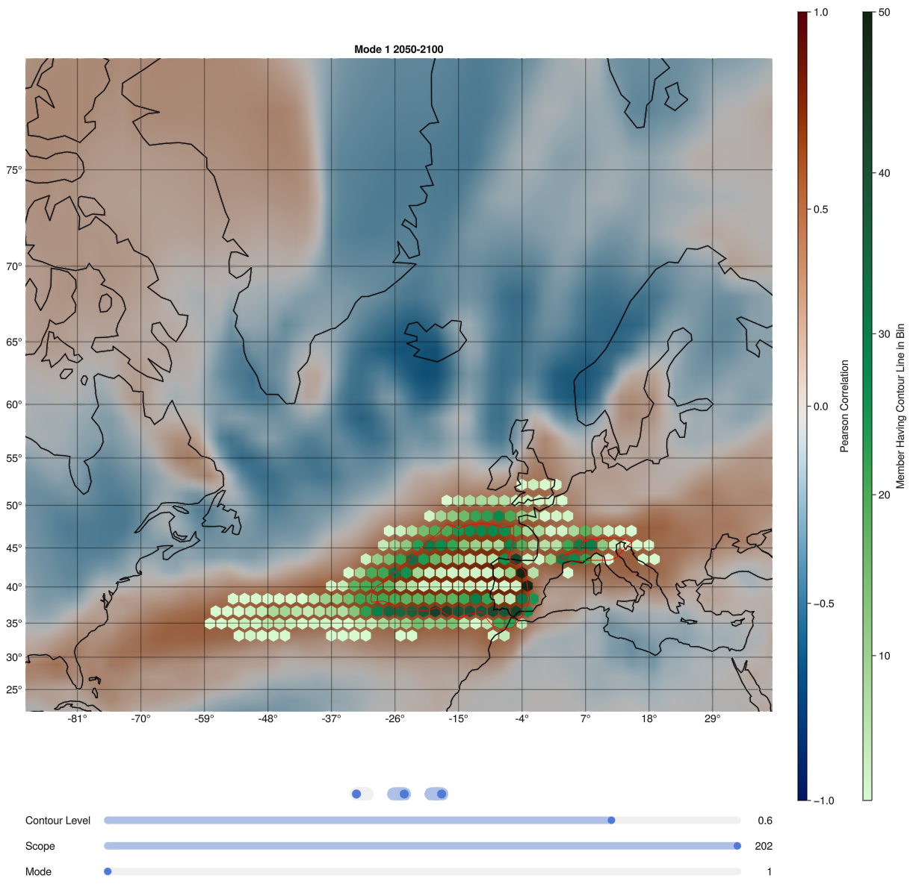
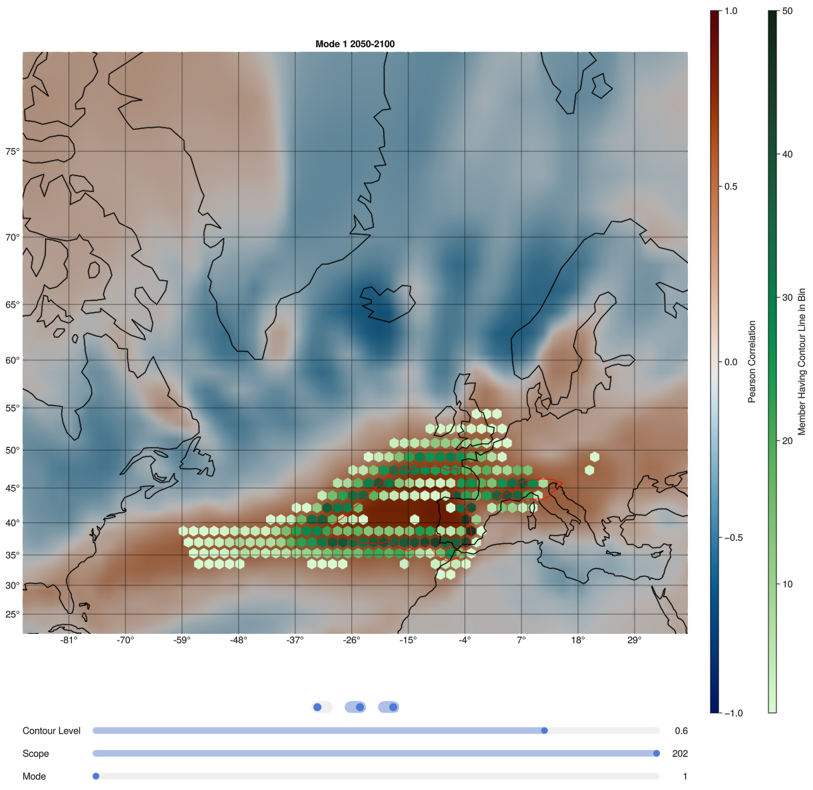

# Analyzing the Evolution of Moisture Transport Patterns in the North Atlantic based on Ensemble Simulations

My master thesis about evaluating the moisture transport to europe based on the MPI-GE CMIP6 dataset in different future climate scenarios.

SSP126             |  SSP585
:-------------------------:|:-------------------------:
 |  

**Correlation Maps of IVT EOF Mode 1 and PR Data**: *Correlation maps of IVT (Integrated Water Vapor Transport) EOF mode 1 and precipitation data of the same scope. Hexbins show the probability of contour lines of 0.6 passing through. The red line indicates the same contour line, but for the preindustrial control simulation.*

## Abstract

The distribution and variability of precipitation in Europe are significantly influenced by moisture transport over the north(east)ern Atlantic.
Due to the turbulent nature of moisture transport, structural changes are difficult to track, which is tackled by analyzing the main variability patterns with a sliding window approach.
The objective of this thesis is to visually analyze and compare changes in different future climate scenarios. 
In addition, we investigated connections with dominant Atlantic oscillation patterns (NAO and EAP) and precipitation in Europe.
Based on the latest MPI GE CMIP6, visualizing the variability introduced by the 50 members of the simulation poses a challenge.
To mitigate the visual clutter associated with the representation of multiple members' contour lines, a hexbin-based approach was used to facilitate the analysis of variability introduced by these numerous members.
The results identified two dominant modes of water vapor transport, which demonstrated considerable stability across different members and time periods, along with structural changes in several spatial patterns. 
In general, the variability explained by all moisture transport variability patterns increases, especially in pronounced climate change scenarios. 
This effect was also observed in the primary pattern of precipitation and EAP.
The modes of moisture transport also exhibited significant correlations with the leading oscillation and precipitation patterns. 

## Content

- Read the thesis in the [thesis](./thesis) subdirectory (see [pdf](./thesis/Thesis.pdf)).
- See the code for preprocessing the huge (multiple TB) datasets on the DKRZ's HPC cluster in [preprocessing](./Preprocessing)
- see the Julia (Geo)Makie code for visualizing the resuls in [Visual Analysis](./visual_analysis).
